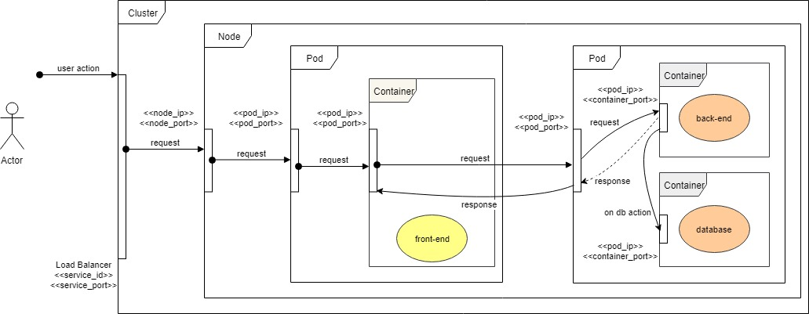

# Introduction

The goal of the project is to better undestand how to configure yaml file for managing k8s deployments.

The system is very easy, it's composed by:

- frontend: ReactJS application for interaction with the user
- backend: node.js application for exposing web api
- database: mongoDB for storing data

The user interacts with the ReactJS application and can do the following actions:

- send a message to the server, save on mongoDB and get the answer from server
- load messages from the database
- clear all messages in the database

## The Architecture

The schema below shows the distribution of the components on k8s. Based on this architecture, in the following sections I'll do some experiments in order to undestand "what happens if I do...".

## Goals

Here there is the list of what I would like to learn:

- understand adresses and ports
- manage pods and nodes in a cluster
- expose the frontend on Internet through services and ingresses
- store data by volumes
- change configuration on the fly

Now we can the application in different environments, in order to understand what is steps that I did to deploy on k8s:

- [Run Locally](assets/readme/run-locally.md)
- [Run on Minikube](assets/readme/run-on-minikube.md)

In the sections below there are commands and examples useful fo this project:

- [Docker Commands](assets/notes/docker-commands.md)
- [K8s Commands](assets/notes/k8s-commands.md)
- [Nginx configuration](assets/notes/nginx-configuration.md)

## References

In the following sections there are links useful during the development of the project, not only closed to the goals described above.

### ReactJS

- https://facebook.github.io/create-react-app/docs/adding-typescript..

### Node.js

- https://blog.risingstack.com/building-a-node-js-app-with-typescript-tutorial/
