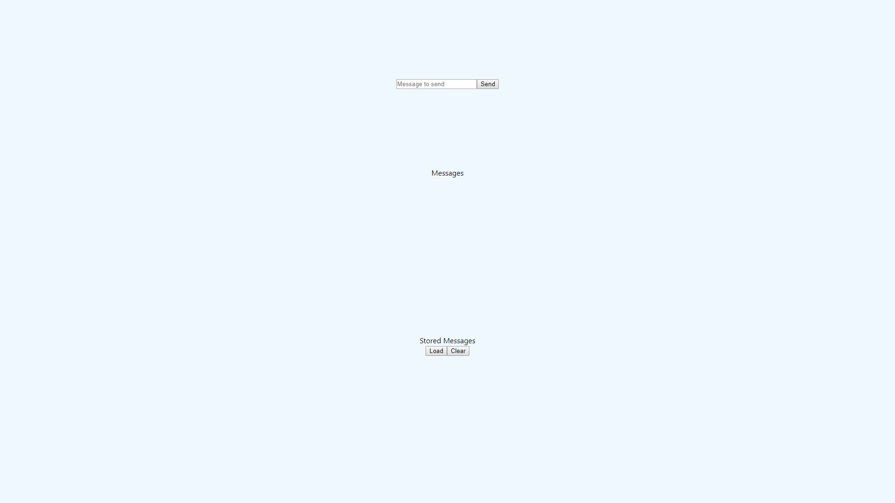

# Run Locally

Before to run the application some requirements need. I list them below:

- node.js
- mongodb

For running the system locally, follow the steps:

- under the backend folder, type:

        npm start
- under the frontend folder, type:

        npm start

The default port for the server is 8080, for the client is 3000.

The application at localhost:3000 is:

Really bad, but doesn't matter for my goals.

Sending messages, you can notice the list in the middle that fills.

NOTE:
Load and Clear buttons work directly on the database.

## Backend Configuration

Go to *assets->config.json*, under the backend project:

- SERVER_PORT (default *5000*): If you change it the frontend must call the new endpoint (see [Frontend Configuration](#Frontend-Configuration))
- ORIGINS_WHITE_LIST: enables cors for specified caller
- CONNECTION_STRING: for local mongodb instance the value is *mongodb://localhost/*
- DATABASE_NAME (default *messages*)

## Frontend Configuration

Go to *public->env-config.js*, under the frontend project:

- SERVER_ENDPOINT (default *"<http://localhost:5000/">*): specifies the backend endpoint. If you change the *SERVER_PORT* in the backend configuration, you must change here.

The *env-config.js* is downloaded for each refresh because is linked in index.html.
